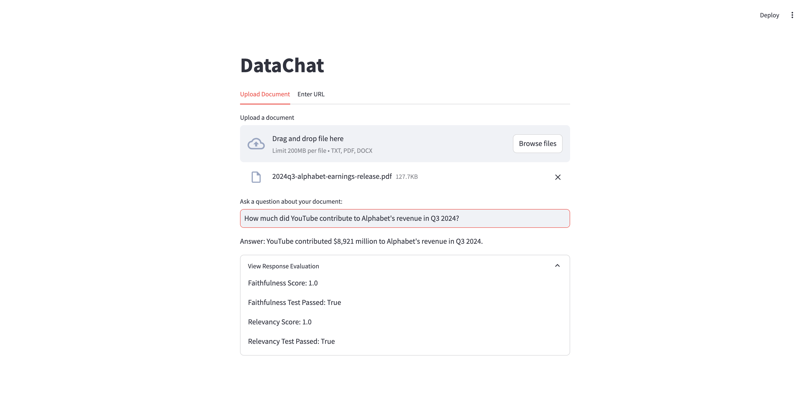
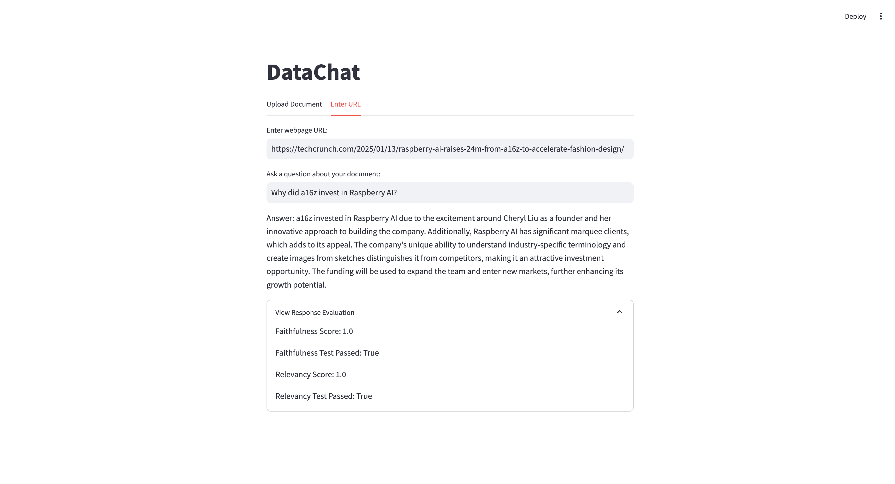

 # Data Chat

This project utilizes a RAG system to answer queries about a document or a webpage. The system includes a Streamlit-based front-end for user interaction and a Flask-based backend for
serving the RAG system.

## Table of Contents

- [Features](#features)
- [Architecture](#architecture)
- [Installation](#installation)
- [Usage](#usage)
- [Screenshot](#screenshot)

## Features

- **RAG System**: Uses a vector database to store and retrieve documents and a LLM to answer queries.
- **Streamlit Front-End**: Interactive and user-friendly interface for entering queries and viewing reports.
- **Flask Backend**: Serves the RAG system and handles user interactions.
- **Evaluation**: The response is evaluated for faithfulness and relevancy using the FaithfulnessEvaluator and RelevancyEvaluator from the llama-index library

## Architecture

1. **Front-End**: A Streamlit-based application for user interaction.
2. **Back-End**: A Flask-based application that serves the RAG system and handles user interactions.
3. **Evaluation**: The response is evaluated for faithfulness and relevancy using the FaithfulnessEvaluator and RelevancyEvaluator from the llama-index library

## Installation

To run the project locally, follow these steps:

1. Clone this repository:

   ```bash
   git clone https://github.com/KhalidRajan/DataChat.git
   cd data-chat

2. Install dependencies:

    ```bash
    pip install -r requirements.txt

3. Run the Streamlit and Flask apps:

    ```bash
    streamlit run app.py  

    ```bash
    flask run

## Usage

1. Start the application using the command above.
2. Upload a document or a webpage.
3. Wait for the system to process the document.
4. Enter a query in the provided text input box in the front-end.
5. Wait for the system to process your query.
6. View the response to your query and the evaluation of the response.

## Screenshot

Below are screenshots of the Streamlit front-end:


